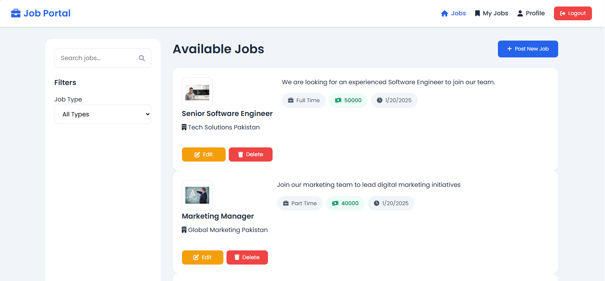
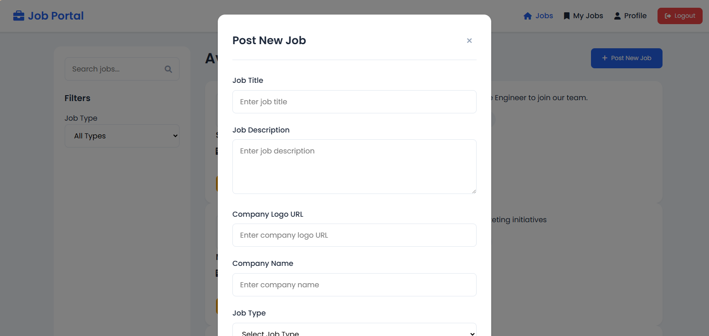
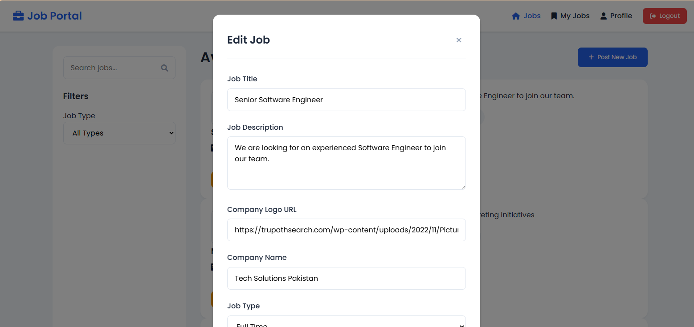
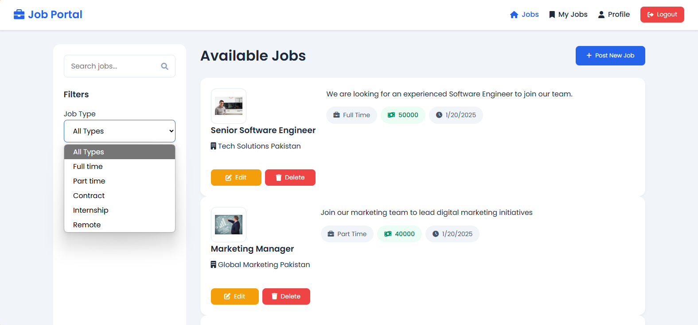
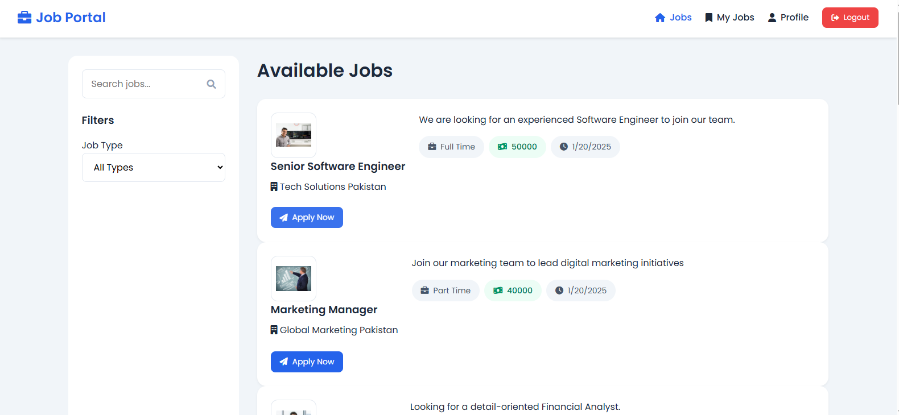
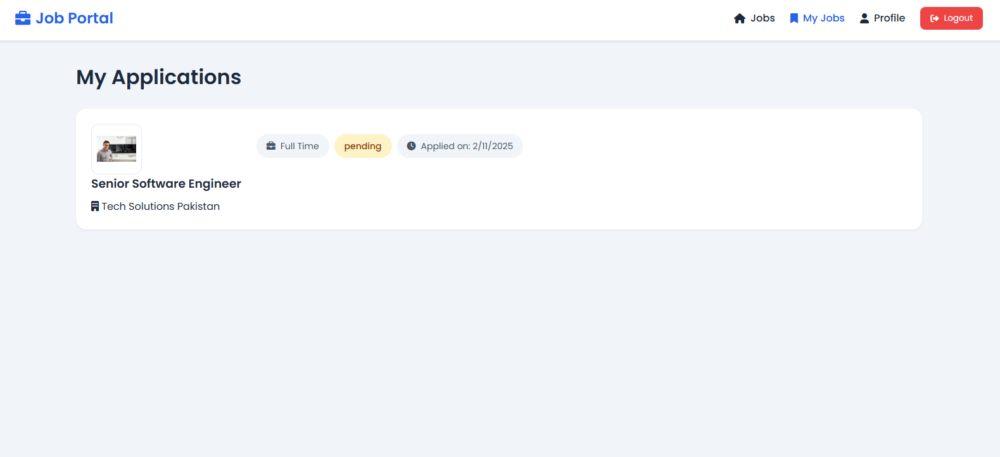
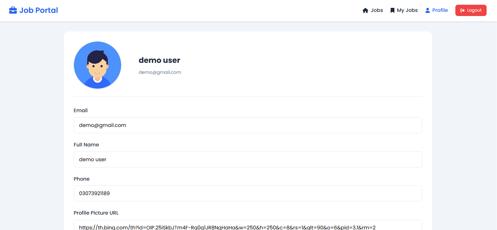

      <h1>  Job Portal</h1>
      <h3>A Modern Job Application Platform</h3>

    
    
    

# 📌 Overview

Job Portal is a modern web application that connects employers and job seekers. It provides a platform for posting jobs, applying to positions, and managing applications efficiently.

# 🛠️ Tech Stack

## 📸 Screenshots

## 🔐 Authentication

  
  
<em>Secure login interface for users and administrators</em>

 ### Admin Interface

  
  
<em>Admin dashboard for managing job listings</em>

  
  
  
<em>Interface for posting new job opportunities</em>

  
  
  
<em>Edit existing job listings</em>

### Admin Profile Management

  
  
  
<em>Admin profile management interface</em>

### Job Search and Filtering

  
  
<em>Advanced job filtering options</em>

### User Experience

  
  
<em>User dashboard for browsing and applying to jobs</em>

  
  
  
<em>Track applied job applications</em>

  
  
  
<em>User profile management</em>

## Demo Credentials

### Admin Account

- Email: admin@gmail.com
- Password: 1234
- Username: admin
- Role: Admin (roleId: 1)

### Demo User Account

- Email: demo@gmail.com
- Password: 1234
- Username: demo
- Role: User (roleId: 2)

## 🚀 Key Features

### User Management

- Role-based authentication (Admin/User)
- Secure login functionality
- Profile management
- Resume/CV upload

### Job Management (Admin)

- Post new job listings
- Edit existing jobs
- Delete job posts
- Track applications

### Job Seeker Features

- Browse available jobs
- Advanced job filtering
- Easy application process
- Application tracking
- Profile customization

### Additional Features

- Responsive design
- User-friendly interface
- Form validation
- Secure authentication
- Job status tracking

## Project Structure

## 🙏 Acknowledgments

- [HTML5](https://developer.mozilla.org/en-US/docs/Web/HTML)
- [CSS3](https://developer.mozilla.org/en-US/docs/Web/CSS)
- [JavaScript](https://developer.mozilla.org/en-US/docs/Web/JavaScript)

## 👨‍💻 Developer Contact

Feel free to reach out to me for any questions or collaboration:

- GitHub: [@jamalihassan0307](https://github.com/jamalihassan0307)
- LinkedIn: [jamalihassan0307](https://www.linkedin.com/in/jamalihassan0307)
